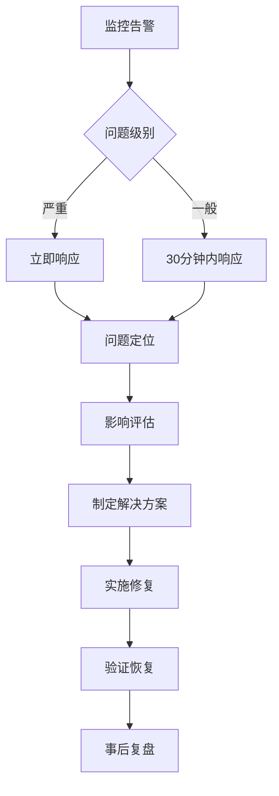

# 上线准备与审核

## Description
完成运动记录分享小程序上线前的所有准备工作，包括代码审查、安全检查、合规性验证、文档整理、微信小程序平台审核材料准备等。确保应用符合微信平台规范和相关法律法规要求，为正式发布做好充分准备。

## Acceptance Criteria
- [ ] 代码安全审查完成，无高危漏洞
- [ ] 敏感信息清理，无硬编码密钥和测试数据
- [ ] 内容安全合规检查通过
- [ ] 用户隐私政策和使用条款制定完成
- [ ] 微信小程序平台审核材料准备齐全
- [ ] 应用图标、截图、描述等素材制作完成
- [ ] 版本号和构建配置确认正确
- [ ] 生产环境配置和测试环境分离
- [ ] 数据备份和恢复方案制定
- [ ] 应急响应预案准备
- [ ] 上线检查清单逐项确认
- [ ] 团队内部上线评审通过

## Technical Details
### 代码安全审查
#### 安全漏洞扫描
```typescript
// 安全检查清单
const securityChecklist = {
  // 输入验证检查
  inputValidation: [
    '所有用户输入都经过验证和清理',
    'SQL注入防护措施到位',
    'XSS攻击防护措施到位',
    '文件上传类型和大小限制'
  ],
  
  // 认证授权检查
  authentication: [
    '用户身份验证机制完整',
    '权限控制粒度合理',
    '会话管理安全',
    'API访问权限控制'
  ],
  
  // 数据安全检査
  dataSecurity: [
    '敏感数据加密存储',
    '数据传输使用HTTPS',
    '个人隐私信息保护',
    '数据备份加密'
  ],
  
  // 配置安全检查
  configuration: [
    '生产环境配置正确',
    '错误信息不泄露敏感信息',
    '日志记录安全',
    '第三方服务安全配置'
  ]
}
```

#### 依赖包安全检查
```bash
# 使用npm audit检查依赖漏洞
npm audit --audit-level moderate

# 使用snyk进行深度安全扫描
snyk test --severity-threshold=high

# 检查过时依赖
npm outdated
```

### 内容安全合规
#### 敏感词过滤系统
```typescript
// 内容安全检测服务
class ContentSecurityService {
  private sensitiveWords: string[] = []
  private contentSecurityAPI = 'https://api.weixin.qq.com/wxa/msg_sec_check'

  async checkTextContent(text: string): Promise<SecurityCheckResult> {
    try {
      // 调用微信内容安全API
      const result = await this.callWeChatSecurityAPI(text)
      
      if (result.errcode === 0) {
        return {
          safe: true,
          confidence: result.confidence,
          label: result.label
        }
      }
      
      return {
        safe: false,
        reason: '内容可能存在风险',
        suggestion: result.suggestion
      }
    } catch (error) {
      // 降级处理：使用本地敏感词过滤
      return this.localSensitiveWordCheck(text)
    }
  }

  async checkImageContent(imageUrl: string): Promise<SecurityCheckResult> {
    // 图片内容审核
    const result = await this.callImageSecurityAPI(imageUrl)
    return {
      safe: result.errcode === 0,
      confidence: result.confidence,
      label: result.label
    }
  }

  private localSensitiveWordCheck(text: string): SecurityCheckResult {
    const lowerText = text.toLowerCase()
    const foundWords = this.sensitiveWords.filter(word => 
      lowerText.includes(word.toLowerCase())
    )
    
    return {
      safe: foundWords.length === 0,
      reason: foundWords.length > 0 ? '包含敏感词汇' : undefined,
      matchedWords: foundWords
    }
  }
}
```

### 微信小程序审核准备
#### 审核材料清单
```markdown
## 小程序审核材料

### 基础信息
- [ ] 小程序名称：运动记录分享
- [ ] 小程序图标：1024x1024px，PNG格式
- [ ] 小程序描述：简洁明了的功能描述
- [ ] 服务类目：工具-运动健身
- [ ] 标签设置：运动、健身、记录、分享

### 功能演示
- [ ] 主要功能截图（5张）
  - 首页/记录列表
  - 记录创建页面
  - 分享图片生成
  - 历史记录查看
  - 个人中心

### 资质文件
- [ ] 软件著作权证书
- [ ] 隐私政策文档
- [ ] 用户服务协议
- [ ] 数据处理说明

### 测试账号
- [ ] 测试账号：testuser001
- [ ] 测试密码：Test@123456
- [ ] 测试数据：包含各类运动记录
```

#### 隐私政策模板
```markdown
## 隐私政策

### 信息收集
我们收集以下信息：
- 微信昵称和头像（用于用户标识）
- 运动记录数据（运动类型、时长、卡路里等）
- 位置信息（用于记录运动地点，可选）
- 设备信息（用于性能优化和错误分析）

### 信息使用
收集的信息用于：
- 提供运动记录和分享功能
- 生成个人运动统计报告
- 改进应用性能和用户体验
- 符合法律法规要求

### 信息保护
- 数据加密传输和存储
- 严格的数据访问权限控制
- 定期数据安全审计
- 符合GDPR和个人信息保护要求
```

### 生产环境配置
#### 环境变量管理
```typescript
// 环境配置
const config = {
  development: {
    apiBase: 'https://dev-api.sports-app.com',
    cloudEnv: 'dev-environment-id',
    debug: true,
    logLevel: 'debug'
  },
  
  production: {
    apiBase: 'https://api.sports-app.com',
    cloudEnv: 'prod-environment-id',
    debug: false,
    logLevel: 'error'
  }
}

// 敏感配置从环境变量读取
const sensitiveConfig = {
  apiKey: process.env.API_KEY,
  apiSecret: process.env.API_SECRET,
  databaseUrl: process.env.DATABASE_URL
}
```

#### 构建配置优化
```javascript
// config/index.js
const config = {
  // 生产环境优化
  mini: {
    webpackChain(chain, webpack) {
      // 代码压缩优化
      chain.optimization.minimize(true)
      
      // 去除console.log
      chain.optimization.sideEffects(false)
      
      // 分包优化
      chain.optimization.splitChunks({
        chunks: 'all',
        cacheGroups: {
          vendor: {
            name: 'vendor',
            test: /[\\/]node_modules[\\/]/,
            priority: 10,
            chunks: 'all'
          }
        }
      })
    }
  }
}
```

### 应急响应预案
#### 应急响应流程


#### 常见问题处理预案
1. **服务不可用**
   - 立即切换到备用服务
   - 启用降级模式
   - 通知用户服务状态

2. **数据异常**
   - 停止数据写入
   - 回滚到最近备份
   - 数据一致性检查

3. **安全漏洞**
   - 立即修复漏洞
   - 强制用户更新
   - 安全审计和加固

## Dependencies
- 兼容性测试完成（任务028）
- 法务和合规团队审核
- 微信小程序开发者账号准备

## Effort Estimate
- **Size**: L (大)
- **Estimated Hours**: 20-28 小时
- **文档准备**: 8-12 小时
- **审核流程**: 3-5 个工作日

## Definition of Done
- [ ] 所有安全检查项目通过
- [ ] 合规性文档准备完成
- [ ] 微信小程序审核材料提交
- [ ] 生产环境配置验证正确
- [ ] 应急响应预案制定完成
- [ ] 团队内部评审通过
- [ ] 上线批准获得相关方签字
- [ ] 最终构建版本确认无误
- [ ] 上线时间窗口确定
- [ ] 相关方通知和协调完成
- [ ] 上线检查清单全部确认
- [ ] 回滚方案准备就绪