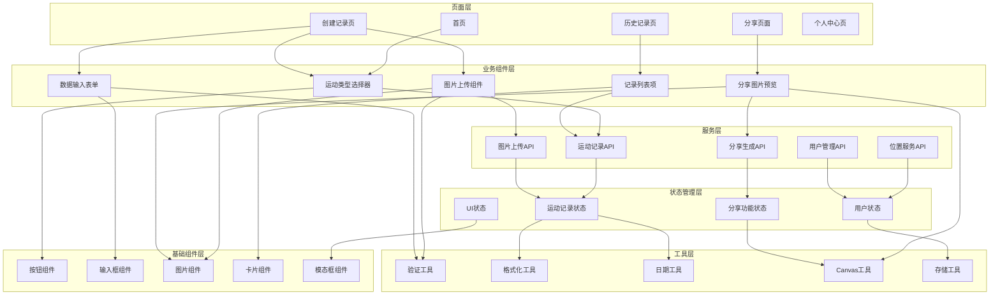
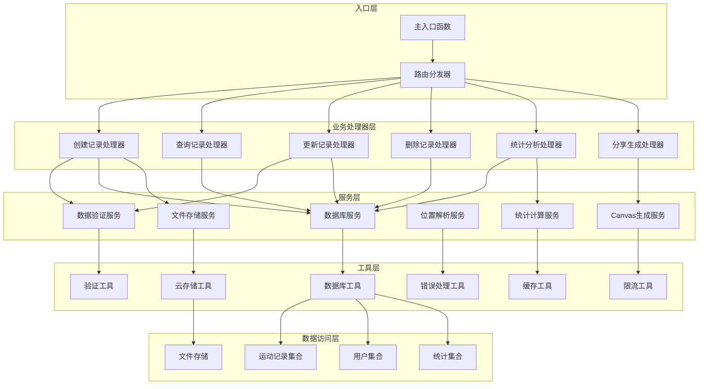

# 🔗 依赖关系映射文档

## 外部依赖分析

### 1. 微信生态依赖

#### 微信小程序平台
```yaml
依赖名称: 微信小程序运行时
版本要求: 基础库版本 >= 2.20.0
功能依赖:
  - 页面生命周期管理
  - 组件系统
  - 事件处理机制
  - 数据绑定
风险等级: 高
缓解措施:
  - 监控基础库版本兼容性
  - 提供版本降级方案
  - 定期测试新版本特性
```

#### 微信开放能力
```yaml
依赖名称: 微信开放API
具体API:
  - wx.login (用户登录)
  - wx.getUserInfo (用户信息)
  - wx.chooseImage (图片选择)
  - wx.getLocation (位置获取)
  - wx.saveImageToPhotosAlbum (保存图片)
  - wx.previewImage (图片预览)
限制条件:
  - 需要用户授权
  - 有调用频率限制
  - 部分API需要特定基础库版本
风险等级: 中
缓解措施:
  - 实现权限申请流程
  - 错误处理和降级方案
  - API调用频率控制
```

### 2. 云服务依赖

#### 腾讯云CloudBase
```yaml
依赖名称: CloudBase MCP Tools
服务组件:
  云函数:
    - 函数计算能力
    - 自动扩缩容
    - 冷启动优化
  云数据库:
    - MongoDB数据库
    - 自动备份
    - 索引管理
  云存储:
    - 文件存储服务
    - CDN加速
    - 权限管理
配额限制:
  - 数据库读操作: 50,000次/天
  - 数据库写操作: 20,000次/天
  - 云函数调用: 100,000次/天
  - 存储空间: 5GB免费
风险等级: 高
缓解措施:
  - 监控资源使用情况
  - 实施缓存策略
  - 代码优化减少资源消耗
  - 准备付费升级方案
```

#### 第三方API服务
```yaml
依赖名称: 腾讯地图API
功能:
  - 逆地址解析
  - 位置服务
  - 地理编码
使用限制:
  - 免费额度: 10,000次/天
  - QPS限制: 5次/秒
  - 需要API密钥
风险等级: 中
缓解措施:
  - 本地缓存地理位置信息
  - 错误重试机制
  - 备选服务商方案

依赖名称: 内容安全API
功能:
  - 敏感词检测
  - 图片内容审核
  - 文本内容审核
使用限制:
  - 按调用次数计费
  - 有审核延迟
风险等级: 低
缓解措施:
  - 本地敏感词预过滤
  - 异步审核流程
  - 人工审核备选方案
```

## 内部依赖关系

### 前端模块依赖图



### 云函数模块依赖图



## 依赖风险分析

### 高风险依赖

#### 1. Canvas API兼容性
```yaml
风险描述: 微信小程序和H5的Canvas API存在差异
影响范围: 分享图片生成功能
概率: 高
影响程度: 高
缓解策略:
  - 封装Canvas操作工具类
  - 平台特性检测
  - 提供降级方案
  - 充分测试验证
监控指标:
  - Canvas绘制成功率
  - 绘制耗时
  - 错误率
```

#### 2. 微信API变更
```yaml
风险描述: 微信API升级可能导致兼容性问题
影响范围: 整个应用的核心功能
概率: 中
影响程度: 高
缓解策略:
  - 关注微信官方更新公告
  - 使用版本检测和适配
  - 建立API变更响应机制
  - 保持基础库版本兼容
监控指标:
  - API调用成功率
  - 用户授权成功率
  - 功能异常报告
```

### 中等风险依赖

#### 1. 云开发配额限制
```yaml
风险描述: 免费额度可能无法满足业务增长需求
影响范围: 应用整体可用性
概率: 中
影响程度: 中
缓解策略:
  - 实施严格的资源监控
  - 优化代码减少资源消耗
  - 建立配额预警机制
  - 准备付费升级方案
监控指标:
  - 数据库读写次数
  - 云函数调用次数
  - 存储空间使用量
  - 费用支出趋势
```

#### 2. 第三方服务稳定性
```yaml
风险描述: 地图API、内容审核服务可能出现不稳定
影响范围: 位置服务、内容安全
概率: 低
影响程度: 中
缓解策略:
  - 建立服务健康检查
  - 实施错误重试机制
  - 准备备选服务商
  - 提供降级功能
监控指标:
  - API响应时间
  - 服务可用性
  - 错误率
  - 重试成功率
```

## 版本兼容性矩阵

### 微信小程序兼容性

| 功能 | 最低基础库版本 | 推荐版本 | 备注 |
|------|---------------|----------|------|
| Canvas 2D | 2.9.0 | 最新版本 | 分享图片生成 |
| 图片选择 | 2.4.0 | 最新版本 | 相册和相机 |
| 位置服务 | 2.0.0 | 最新版本 | GPS定位和地址解析 |
| 文件上传 | 2.4.0 | 最新版本 | 图片上传到云存储 |
| 登录授权 | 2.0.0 | 最新版本 | 用户身份验证 |

### 浏览器兼容性

| 浏览器 | 最低版本 | 支持功能 | 备注 |
|--------|----------|----------|------|
| Chrome | 70+ | 全部功能 | 推荐浏览器 |
| Safari | 12+ | 全部功能 | iOS设备 |
| Firefox | 65+ | 全部功能 | 可选浏览器 |
| Edge | 79+ | 全部功能 | Chromium内核 |
| IE | 不支持 | - | 建议使用现代浏览器 |

## 部署依赖关系

### 开发环境依赖
```yaml
Node.js: >= 16.0.0
npm: >= 8.0.0
Git: >= 2.20.0
微信开发者工具: 最新稳定版
VS Code: 推荐编辑器
```

### 生产环境依赖
```yaml
微信小程序平台: 已认证的小程序账号
CloudBase环境: 已开通的云开发环境
域名备案: 如需H5独立域名
SSL证书: HTTPS安全证书
CDN服务: 静态资源加速
监控服务: 应用性能监控
```

## 监控和告警

### 关键指标监控

#### 1. 业务指标
- 用户活跃度（日活、月活）
- 功能使用率（记录创建、分享生成）
- 用户留存率（次日、7日、30日）
- 分享转化率

#### 2. 技术指标
- API响应时间
- 错误率和异常率
- 页面加载时间
- 服务可用性

#### 3. 资源使用指标
- 云开发资源使用量
- 第三方API调用量
- 存储空间使用量
- 费用支出情况

### 告警配置

```yaml
高优先级告警:
  - 服务不可用 > 1分钟
  - API错误率 > 5%
  - 数据库连接失败

中优先级告警:
  - API响应时间 > 2秒
  - 资源使用量 > 80%
  - 第三方服务异常

低优先级告警:
  - 性能指标异常
  - 用户投诉增加
  - 监控数据缺失
```

---

**文档维护者**: 技术团队  
**最后更新**: 2025-09-09  
**审核状态**: 已审核  
**版本**: v1.0.0  

**相关文档**:
- [技术决策记录](./technical-decisions.md)
- [实施史诗](./epic.md)
- [项目架构文档](../architecture.md)