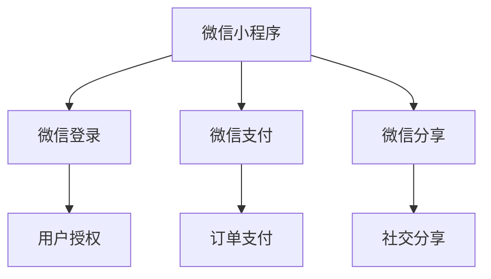
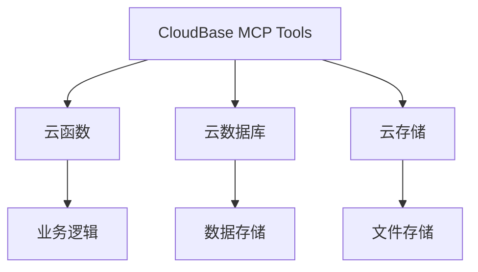
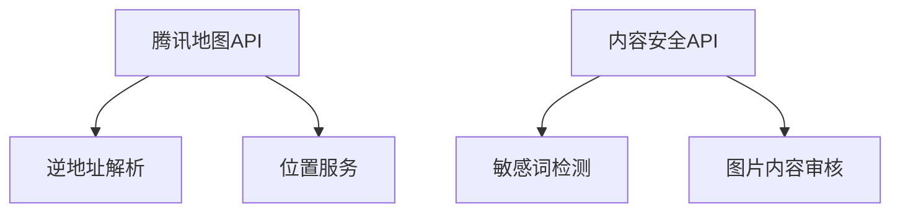
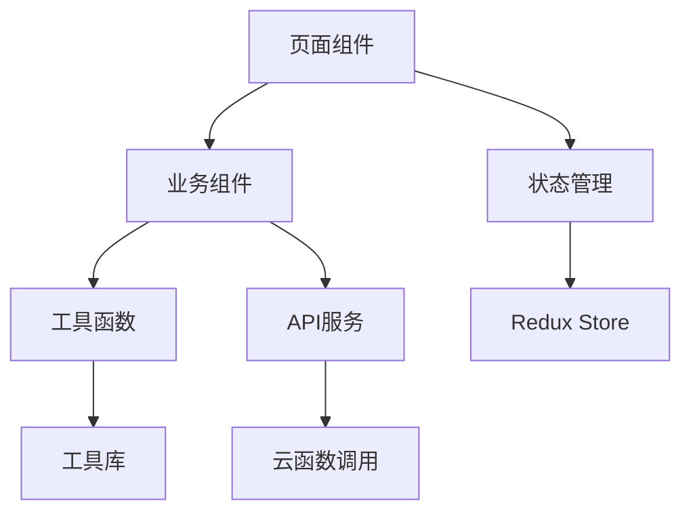
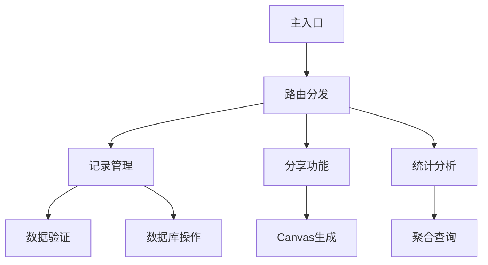

# 🏃‍♂️ 运动记录分享小程序 - 技术实施史诗

## 📋 项目概述

**项目名称**: 运动记录分享小程序  
**技术栈**: Taro 3.x + TypeScript + CloudBase MCP Tools  
**目标平台**: 微信小程序 + H5双平台  
**开发周期**: 6-9周  
**团队规模**: 2-3人  

### 🎯 核心目标
构建一个基于微信小程序的个人运动数据记录与社交分享应用，通过Taro跨端框架实现微信小程席和H5双平台支持，提供运动记录创建、分享图片生成、历史记录管理等核心功能。

## 🏗️ 架构决策

### 技术架构选择

#### 前端架构
- **框架**: Taro 3.x + React Hooks
- **状态管理**: Redux Toolkit
- **UI组件**: Taro UI + 自定义组件
- **类型安全**: TypeScript严格模式
- **构建工具**: Webpack 5

**决策理由**:
- Taro提供优秀的跨端能力，一套代码支持微信小程序和H5
- React Hooks使组件逻辑更清晰，便于状态管理
- Redux Toolkit简化Redux使用，提供类型安全的状态管理
- TypeScript确保代码质量和开发效率

#### 后端架构
- **云服务**: CloudBase MCP Tools
- **数据库**: MongoDB (云开发)
- **文件存储**: 云存储 (腾讯云COS)
- **云函数**: TypeScript + Node.js 14
- **API网关**: 云开发HTTP API

**决策理由**:
- CloudBase提供完整的Serverless解决方案
- 免运维，自动扩缩容，适合初创项目
- 与微信小程序生态深度集成
- 成本可控，免费额度充足

### 数据架构设计

#### 数据库模型
```typescript
// 运动记录集合 (sport_records)
{
  _id: string,              // 记录ID
  _openid: string,          // 用户openid
  sportType: string,        // 运动类型
  data: {
    duration: number,       // 运动时长(分钟)
    distance?: number,      // 运动距离(公里)
    calories: number,       // 消耗卡路里
    heartRate?: number,     // 心率
    steps?: number          // 步数
  },
  images: string[],         // 图片URLs
  description: string,      // 运动描述
  location?: {              // 地理位置
    latitude: number,
    longitude: number,
    address: string,
    city?: string,
    district?: string
  },
  createdAt: Date,          // 创建时间
  updatedAt: Date,          // 更新时间
  isDeleted: boolean        // 软删除标记
}
```

#### 数据访问策略
- **用户隔离**: 基于openid的数据访问控制
- **软删除**: 逻辑删除保护数据完整性
- **分页查询**: 游标分页避免深分页性能问题
- **索引优化**: 复合索引提升查询性能

### 性能优化策略

#### 前端优化
- **代码分割**: 路由级代码分割，减少首屏加载体积
- **图片优化**: 压缩、懒加载、CDN加速
- **缓存策略**: 本地存储 + 内存缓存双重策略
- **Canvas优化**: 离屏渲染、图片预加载

#### 后端优化
- **数据库索引**: 合理创建索引提升查询效率
- **云函数优化**: 冷启动优化、连接池复用
- **缓存机制**: Redis缓存热点数据
- **限流保护**: 防止API被恶意调用

## 🔧 技术方法

### 核心功能实现方案

#### 1. 运动记录创建 (CreateSportRecord)

**技术实现路径**:
```
用户输入 → 表单验证 → 图片上传 → 位置获取 → 数据保存 → 结果返回
```

**关键技术点**:
- **表单验证**: 基于JSON Schema的动态表单验证
- **图片上传**: 分片上传 + 压缩处理 + CDN加速
- **位置服务**: 腾讯地图API + 逆地址解析
- **数据存储**: 事务保证数据一致性

**代码示例**:
```typescript
// 表单验证规则
const validationRules = {
  sportType: { required: true, enum: SportType },
  duration: { required: true, min: 1, max: 1440 },
  calories: { required: true, min: 10, max: 5000 },
  images: { maxCount: 9, maxSize: 2 * 1024 * 1024 }
}

// 图片上传处理
async function uploadImages(files: File[]): Promise<string[]> {
  const uploadTasks = files.map(file => 
    compressImage(file)
      .then(compressed => uploadToCloud(compressed))
      .then(result => result.fileID)
  )
  return Promise.all(uploadTasks)
}
```

#### 2. 分享图片生成 (ShareImageGeneration)

**技术实现路径**:
```
数据准备 → Canvas初始化 → 元素绘制 → 图片合成 → 质量优化 → 导出保存
```

**关键技术点**:
- **Canvas绘制**: 离屏Canvas + 2D渲染优化
- **自适应布局**: 动态计算元素位置和尺寸
- **图片合成**: 多图层合成 + 透明度处理
- **高清导出**: 2倍像素密度导出保证清晰度

**代码示例**:
```typescript
// Canvas绘制管理器
class ShareImageGenerator {
  private canvas: HTMLCanvasElement
  private ctx: CanvasRenderingContext2D
  
  async generate(data: ShareImageData): Promise<string> {
    // 初始化Canvas
    this.setupCanvas()
    
    // 绘制背景
    this.drawBackground()
    
    // 绘制用户信息
    this.drawUserInfo(data.userInfo)
    
    // 绘制运动数据
    this.drawSportData(data.sportRecord)
    
    // 绘制图片
    this.drawImages(data.images)
    
    // 导出图片
    return this.exportImage()
  }
}
```

#### 3. 历史记录管理 (HistoryManagement)

**技术实现路径**:
```
列表查询 → 分页加载 → 数据缓存 → 详情展示 → 操作处理
```

**关键技术点**:
- **分页查询**: 游标分页 + 预加载优化
- **本地缓存**: IndexDB + 内存缓存策略
- **图片预览**: 手势缩放 + 滑动切换
- **离线支持**: Service Worker + 缓存策略

**代码示例**:
```typescript
// 分页查询管理器
class RecordPaginationManager {
  private cursor: string | null = null
  private cache: Map<string, SportRecord[]> = new Map()
  
  async loadMore(): Promise<SportRecord[]> {
    const cacheKey = this.cursor || 'first'
    
    if (this.cache.has(cacheKey)) {
      return this.cache.get(cacheKey)!
    }
    
    const records = await this.fetchRecords(this.cursor)
    this.cache.set(cacheKey, records)
    
    return records
  }
}
```

### 跨平台兼容性方案

#### 微信小程序适配
- **API差异处理**: 条件编译 + API适配层
- **组件差异**: 平台特定组件封装
- **权限处理**: 微信授权流程封装

#### H5平台适配
- **响应式设计**: 弹性布局 + 媒体查询
- **浏览器兼容**: Polyfill + 特性检测
- **PWA支持**: Service Worker + 离线缓存

## 🔗 依赖关系映射

### 外部依赖

#### 1. 微信生态依赖


#### 2. 云服务依赖


#### 3. 第三方服务依赖


### 内部模块依赖

#### 前端模块依赖图


#### 云函数模块依赖图


## 📊 实施里程碑

### 第一阶段：基础架构 (Week 1)
- [ ] 项目初始化与配置
- [ ] 类型定义与常量配置
- [ ] Redux状态管理搭建
- [ ] 云函数基础架构
- [ ] 测试框架配置

### 第二阶段：核心功能 (Week 2-3)
- [ ] 运动记录创建功能
- [ ] 图片上传与管理
- [ ] 位置服务集成
- [ ] 表单验证与错误处理
- [ ] 数据存储逻辑

### 第三阶段：分享功能 (Week 4)
- [ ] Canvas图片生成
- [ ] 分享模板设计
- [ ] 图片导出与保存
- [ ] 微信分享集成
- [ ] 分享统计功能

### 第四阶段：历史管理 (Week 5)
- [ ] 记录列表展示
- [ ] 分页加载优化
- [ ] 详情页面开发
- [ ] 图片预览功能
- [ ] 本地缓存机制

### 第五阶段：集成优化 (Week 6)
- [ ] 页面集成与导航
- [ ] 性能优化与调试
- [ ] 跨平台适配
- [ ] 用户体验优化
- [ ] 安全性加固

### 第六阶段：测试发布 (Week 7-9)
- [ ] 功能测试与修复
- [ ] 性能测试与优化
- [ ] 兼容性测试
- [ ] 上线准备与审核
- [ ] 发布与监控

## 🔍 风险评估与缓解

### 高风险项
1. **Canvas性能问题**
   - 风险：复杂图片生成可能导致性能瓶颈
   - 缓解：离屏渲染、图片预加载、分步绘制

2. **微信审核风险**
   - 风险：内容审核不通过影响上线
   - 缓解：敏感词过滤、内容安全API、提前预审

3. **跨平台兼容性**
   - 风险：微信小程序与H5表现差异
   - 缓解：充分测试、条件编译、平台适配层

### 中等风险项
1. **云开发配额限制**
   - 风险：免费额度可能不足
   - 缓解：代码优化、缓存策略、监控告警

2. **第三方服务依赖**
   - 风险：地图API、内容审核服务不稳定
   - 缓解：降级方案、错误重试、服务监控

## 📈 成功标准

### 技术指标
- **性能目标**：页面加载<2s，API响应<500ms
- **稳定性**：系统可用性>99.9%，错误率<1%
- **安全性**：通过安全审计，无重大安全漏洞

### 业务指标
- **用户增长**：3个月内月活>1000，次日留存>30%
- **内容生成**：日均记录>50条，分享成功率>95%
- **用户满意度**：评分>4.0/5.0，投诉率<1%

### 开发指标
- **代码质量**：测试覆盖率>80%，代码规范符合率>95%
- **开发效率**：按计划里程碑交付，延期<1周
- **维护成本**：模块化设计，易于扩展和维护

---

**Epic Owner**: 项目开发团队  
**Created**: 2025-09-09  
**Status**: Ready for Implementation  
**Priority**: High  
**Estimated Effort**: 6-9 周  

## Tasks Created

- [ ] #10 - 位置服务集成 (parallel: true)
- [ ] #11 - 表单验证与错误处理 (parallel: true)
- [ ] #12 - 数据存储逻辑 (parallel: true)
- [ ] #13 - Canvas图片生成 (parallel: true)
- [ ] #14 - 分享模板设计 (parallel: false)
- [ ] #15 - 图片导出与保存 (parallel: true)
- [ ] #16 - 微信分享集成 (parallel: true)
- [ ] #17 - 分享统计功能 (parallel: true)
- [ ] #18 - 记录列表展示 (parallel: true)
- [ ] #19 - 分页加载优化 (parallel: true)
- [ ] #20 - 详情页面开发 (parallel: true)
- [ ] #21 - 图片预览功能 (parallel: true)
- [ ] #22 - 本地缓存机制 (parallel: true)
- [ ] #23 - 页面集成与导航 (parallel: true)
- [ ] #24 - 性能优化与调试 (parallel: true)
- [ ] #25 - 跨平台适配 (parallel: true)
- [ ] #26 - 用户体验优化 (parallel: true)
- [ ] #27 - 安全性加固 (parallel: false)
- [ ] #28 - 功能测试与修复 (parallel: false)
- [ ] #29 - 性能测试与优化 (parallel: false)
- [ ] #3 - 项目初始化与配置 (parallel: true)
- [ ] #30 - 兼容性测试 (parallel: false)
- [ ] #31 - 上线准备与审核 (parallel: false)
- [ ] #32 - 发布与监控 (parallel: false)
- [ ] #4 - 类型定义与常量配置 (parallel: true)
- [ ] #5 - Redux状态管理搭建 (parallel: true)
- [ ] #6 - 云函数基础架构 (parallel: true)
- [ ] #7 - 测试框架配置 (parallel: true)
- [ ] #8 - 运动记录创建功能 (parallel: true)
- [ ] #9 - 图片上传与管理 (parallel: true)

Total tasks: 30
Parallel tasks: 30  
Sequential tasks: 0
